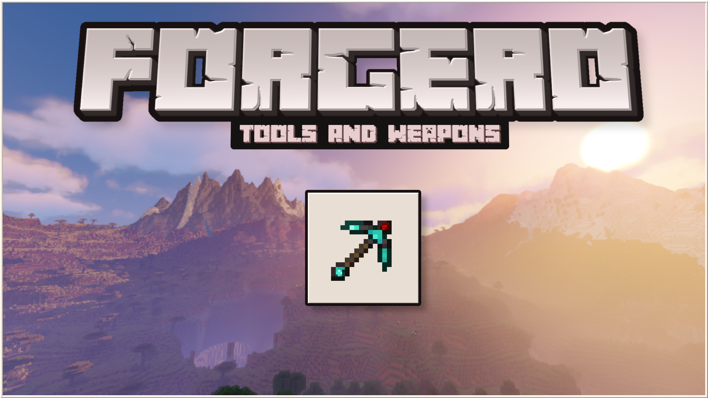

<div id="top"></div>

<!-- PROJECT SHIELDS -->
<!--
*** I'm using markdown "reference style" links for readability.
*** Reference links are enclosed in brackets [ ] instead of parentheses ( ).
*** See the bottom of this document for the declaration of the reference variables
*** for contributors-url, forks-url, etc. This is an optional, concise syntax you may use.
*** https://www.markdownguide.org/basic-syntax/#reference-style-links
-->
[![Contributors][contributors-shield]][contributors-url]
[![Forks][forks-shield]][forks-url]
[![Stargazers][stars-shield]][stars-url]
[![Issues][issues-shield]][issues-url]
[![MIT License][license-shield]][license-url]
[![LinkedIn][linkedin-shield]][linkedin-url]


<!-- PROJECT LOGO -->
<br />
<div align="center">
  <a href="https://www.curseforge.com/minecraft/mc-mods/forgero">
    
  </a>

<h3 align="center">Forgero [Fabric]</h3>

  <p align="center">
    A tool creation and customization mod for Minecraft!
    <br />
    <a href="https://github.com/sigmundgranaas/forgero/wiki"><strong>Explore the docs »</strong></a>
    <br />
    <br />
    <a href="https://github.com/sigmundgranaas/forgero/issues">Report Bug</a>
    ·
    <a href="https://github.com/sigmundgranaas/forgeroissues">Request Feature</a>
  </p>
</div>


<!-- TABLE OF CONTENTS -->
<details>
  <summary>Table of Contents</summary>
  <ol>
    <li>
      <a href="#about-the-project">About The Project</a>
      <ul>
        <li><a href="#built-with">Built With</a></li>
      </ul>
    </li>
    <li>
      <a href="#getting-started">Getting Started</a>
      <ul>
        <li><a href="#prerequisites">Prerequisites</a></li>
        <li><a href="#installation">Installation</a></li>
      </ul>
    </li>
    <li><a href="#roadmap">Roadmap</a></li>
    <li><a href="#contributing">Contributing</a></li>
    <li><a href="#license">License</a></li>
    <li><a href="#contact">Contact</a></li>
    <li><a href="#acknowledgments">Acknowledgments</a></li>
  </ol>
</details>


<!-- ABOUT FORGERO -->

## About

<div align="center">
  <a href="https://www.curseforge.com/minecraft/mc-mods/forgero">
    
  </a>
<div/>

Forgero was created to fill a gap in the mods available for Fabric. The aim of the mod is to give tool creation and
customization in Minecraft a greater depth.

Key features:

* A wide variety of materials can be used to craft every part of a tool (But some are better suited than others)
* Unique patterns which will enhance the look and attributes of your tools
* Vanilla friendly, this mod generates textures from palettes created from Minecraft's own textures
* Gems, which can further enhance tools and weapons through an expansive upgrade path
* Enchanting support
* Support for adding and customizing materials, patterns and gems entirely trough config files

<p align="right">(<a href="#top">back to top</a>)</p>

### Built With

This project is created with Fabric, and its toolchain

* [Fabric mod template](https://github.com/FabricMC/fabric-example-mod)
* [Fabric API](https://github.com/FabricMC/fabric)

<p align="right">(<a href="#top">back to top</a>)</p>


<!-- GETTING STARTED -->

## Getting Started with modding

Modding Minecraft is very easy using the tools developed by the modding community.

### Prerequisites

If you wish to run this project without using and IDE, you need to install java 17, and Gradle

* [Azul OpenJDK 17](https://www.azul.com/downloads/?package=jdk)
* [Gradle](https://gradle.org/)

### Installation

Setting up Forgero is best done using

1. Clone the project from this repository
   ```sh
   git clone https://github.com/sigmundgranaas/forgero.git
   ```
2. Install [Intellij IDEA](https://www.jetbrains.com/idea/download/)
     ```sh
   install intellij from: https://www.jetbrains.com/idea/download/
   ```

3. Open Forgero in Intellij
   ```sh
   new > project from existing sources > choose forgero folder
   ```
4. Make changes and run Forgero
   ```sh
   Make canges and run Minecraft by choosing the runClient gradle task from the righand Gradle menu
   ```

<p align="right">(<a href="#top">back to top</a>)</p>


<!-- ROADMAP -->

## Roadmap

Forgero is in active development, and features are being added frequently.

- [x] Add tool parts and materials
- [x] Pickaxe, Shovel and axe
- [x] Gems
- [x] Patterns
- [ ] Sword and hoe support
- [ ] Support for enhanced tool properties, like golden and a 3x3 breaking area
- [ ] Rework model system to avoid flickering textures

See the [open issues](https://github.com/sigmundgranaas/forgero/issues) for a full list of proposed features (and known
issues).

<p align="right">(<a href="#top">back to top</a>)</p>


<!-- CONTRIBUTING -->

## Contributing

If you have a suggestion that would make this better, please fork the repo and create a pull request. You can also
simply open an issue with the tag "enhancement". Don't forget to give the project a star! Thanks again! Your
contributions are **Greatly appreciated**

1. [Fork](https://github.com/sigmundgranaas/forgero/fork) the Project to your Github account
2. Set up the project as described in the installation section
3. Create your Feature Branch (`git checkout -b feature/AmazingFeature`)
4. Commit your Changes (`git commit -m 'Add some AmazingFeature'`)
5. Push to the Branch (`git push origin feature/AmazingFeature`)
6. Open a [Pull request](https://github.com/sigmundgranaas/forgero/pulls) here

<p align="right">(<a href="#top">back to top</a>)</p>


<!-- LICENSE -->

## License

Distributed under the MIT License. See `LICENSE.txt` for more information.

<p align="right">(<a href="#top">back to top</a>)</p>


<!-- CONTACT -->

## Contact

Sigmund Granaas Sandring

Project Link: [https://github.com/sigmundgranaas/forgero](https://github.com/sigmundgranaas/forgero)

<p align="right">(<a href="#top">back to top</a>)</p>


<!-- ACKNOWLEDGMENTS -->

## Acknowledgments

Creating this project could not have been done without the prior work of the community.

* [The Fabric project](https://fabricmc.net/)
* [Tinker's Construct](https://github.com/SlimeKnights/TinkersConstruct)
* [Smithee](https://github.com/LordDeatHunter/Smithee)
* [Minecraft](https://www.minecraft.net)
* [Readme template](ttps://github.com/othneildrew/Best-README-Template/)

<p align="right">(<a href="#top">back to top</a>)</p>


<!-- MARKDOWN LINKS & IMAGES -->
<!-- https://www.markdownguide.org/basic-syntax/#reference-style-links -->

[contributors-shield]: https://img.shields.io/github/contributors/sigmundgranaas/forgero.svg?style=for-the-badge

[contributors-url]: https://github.com/sigmundgranaas/forgero/graphs/contributors

[forks-shield]: https://img.shields.io/github/forks/sigmundgranaas/forgero.svg?style=for-the-badge

[forks-url]: https://github.com/sigmundgranaas/forgero/network/members

[stars-shield]: https://img.shields.io/github/stars/sigmundgranaas/forgero.svg?style=for-the-badge

[stars-url]: https://github.com/sigmundgranaas/forgero/stargazers

[issues-shield]: https://img.shields.io/github/issues/sigmundgranaas/forgero.svg?style=for-the-badge

[issues-url]: https://github.com/othneildrew/Best-README-Template/issues

[license-shield]: https://img.shields.io/github/license/sigmundgranaas/forgero.svg?style=for-the-badge

[license-url]: https://github.com/sigmundgranaas/forgero/blob/master/LICENSE.txt

[linkedin-shield]: https://img.shields.io/badge/-LinkedIn-black.svg?style=for-the-badge&logo=linkedin&colorB=555

[linkedin-url]: https://linkedin.com/in/sigmundgranaas

[product-screenshot]: assets/Banner.png