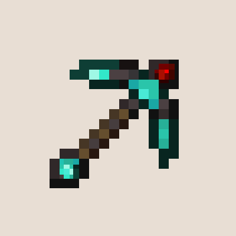

<div id="top"></div>

<!-- PROJECT SHIELDS -->
<!--
*** I'm using markdown "reference style" links for readability.
*** Reference links are enclosed in brackets [ ] instead of parentheses ( ).
*** See the bottom of this document for the declaration of the reference variables
*** for contributors-url, forks-url, etc. This is an optional, concise syntax you may use.
*** https://www.markdownguide.org/basic-syntax/#reference-style-links
-->
[![Contributors][contributors-shield]][contributors-url]
[![Forks][forks-shield]][forks-url]
[![Stargazers][stars-shield]][stars-url]
[![Issues][issues-shield]][issues-url]
[![MIT License][license-shield]][license-url]
[![LinkedIn][linkedin-shield]][linkedin-url]
[![Discord][discord-shield]][discord-url]


<!-- PROJECT LOGO -->
<br />
<div align="center">
  <a href="https://www.curseforge.com/minecraft/mc-mods/forgero">
    
  </a>

<h3 align="center">Forgero [Fabric]</h3>

  <p align="center">
    A tool creation and customization mod for Minecraft!
    <br />
    <a href="https://github.com/sigmundgranaas/forgero/wiki"><strong>Explore the docs »</strong></a>
    <br />
    <br />
    <a href="https://github.com/sigmundgranaas/forgero/issues">Report Bug</a>
    ·
    <a href="https://github.com/sigmundgranaas/forgeroissues">Request Feature</a>
  </p>
</div>


<!-- ABOUT FORGERO -->

## About

<a href="https://www.curseforge.com/minecraft/mc-mods/forgero">
    
</a>

**Forgero was created to fill a gap in the mods available for Fabric. The aim of the mod is to give tool creation and
customization in Minecraft a greater depth.**

Key features:

* A wide variety of materials can be used to craft every part of a tool (But some are better suited than others)
* Unique schematics which will enhance the look and attributes of your tools
* Vanilla friendly, this mod generates textures from palettes created from Minecraft's own textures
* Gems, which can further enhance tools and weapons through an expansive upgrade path
* Enchanting support
* Support for adding and customizing materials, schematics and gems entirely trough config files

<!-- ROADMAP -->

## Roadmap

Forgero is in active development, and features are being added frequently.  
We support [Semantic Versioning](https://semver.org/), which means we make sure to not introduce breaking changes unless
we are moving to a new major version.

- [x] Tool parts and materials
- [x] Pickaxes, shovels and axes
- [x] Swords and hoes
- [x] Rework model system to avoid flickering textures
- [x] Schematics
- [x] Enhanced tool properties, for example golden, and veinmining, as well as area mining
- [x] Gems
- [ ] Progression and station overhaul
- [ ] Bows and arrows
- [ ] Armor sets

See the [open issues](https://github.com/sigmundgranaas/forgero/issues) for a full list of proposed features and known
bugs.


<!-- CONTRIBUTING -->

## Contributing

If you want to improve a feature or fix a bug in Forgero, feel free to fork the repo and create a pull request.  
You can also simply open an issue with the tag `enhancement`.

1. [Fork](https://github.com/sigmundgranaas/forgero/fork) Forgero to your Github account
2. Set up the project as described in the [development section](#development)
3. Create your feature branch: `git checkout -b feature/amazing-feature`
4. Commit your changes: `git commit -m 'Add an amazing feature'`
5. Push to the branch: `git push origin feature/amazing-feature`
6. Open a [pull request](https://github.com/sigmundgranaas/forgero/pulls)

Don't forget to give the project a star! Thanks again!  
Your contributions are **greatly appreciated**.

Thank you to Forgero's contributors (
see [`CONTRIBUTORS.md`](https://github.com/SigmundGranaas/forgero/blob/1.19/CONTRIBUTORS.md)).


<!-- DEVELOPMENT -->

## Development

Modding Minecraft is very easy thanks to the tools developed by the modding community.

### Prerequisites

#### IntelliJ IDEA

IntelliJ IDEA should already come with their own Java JDK and Gradle version out of the box, and is recommended for
Minecraft development:

- [IntelliJ IDEA](https://www.jetbrains.com/idea/download)
- [Minecraft Development plugin](https://mcdev.io/)

#### Different IDE/no IDE

If you don't want to use IntelliJ IDEA, but instead you want to use another IDE (or no IDE) that doesn't contain these
prerequisites out of the box:

* Your preferred build of Java 17, we recommend using [Adoptium Temurin OpenJDK 17](https://adoptium.net/temurin/)
* [Gradle](https://gradle.org/)

### Setting up the repository

1. Clone this repository (can be done via the command line or your IDE):
   ```sh
   git clone https://github.com/sigmundgranaas/forgero.git
   ```

2. Open Forgero in IntelliJ IDEA (or your IDE of choice/no IDE):
   ```sh
   new > project from existing sources > choose forgero folder
   ```
3. Make changes and run Forgero (can be done via the command line or your IDE):
   ```sh
   ./gradlew runClient
   ```

<!-- LICENSE -->

## License

Distributed under the MIT License. See [`LICENSE`](https://github.com/SigmundGranaas/forgero/blob/1.19/LICENSE) for more
information.


<!-- CONTACT -->

## Contact

Sigmund Granaas Sandring:

- [GitHub](https://github.com/SigmundGranaas)
- [Discord](https://discord.gg/3vK7ZwEDex)

<!-- ACKNOWLEDGMENTS -->

## Acknowledgments

Creating this project could not have been done without the prior work of the community.

* [Minecraft](https://www.minecraft.net)
* [The Fabric Project](https://fabricmc.net/)
* [Fabric mod template](https://github.com/FabricMC/fabric-example-mod)
* [Fabric API](https://github.com/FabricMC/fabric)
* [Tinker's Construct](https://github.com/SlimeKnights/TinkersConstruct)
* [Smithee](https://github.com/LordDeatHunter/Smithee)
* [Readme template](https://github.com/othneildrew/Best-README-Template/)

<!-- MARKDOWN LINKS & IMAGES -->
<!-- https://www.markdownguide.org/basic-syntax/#reference-style-links -->

[product-screenshot]: assets/Banner.png

[contributors-shield]: https://img.shields.io/github/contributors/sigmundgranaas/forgero.svg?style=for-the-badge

[contributors-url]: https://github.com/sigmundgranaas/forgero/graphs/contributors

[forks-shield]: https://img.shields.io/github/forks/sigmundgranaas/forgero.svg?style=for-the-badge

[forks-url]: https://github.com/sigmundgranaas/forgero/network/members

[stars-shield]: https://img.shields.io/github/stars/sigmundgranaas/forgero.svg?style=for-the-badge

[stars-url]: https://github.com/sigmundgranaas/forgero/stargazers

[issues-shield]: https://img.shields.io/github/issues/sigmundgranaas/forgero.svg?style=for-the-badge

[issues-url]: https://github.com/othneildrew/Best-README-Template/issues

[license-shield]: https://img.shields.io/github/license/sigmundgranaas/forgero.svg?style=for-the-badge

[license-url]: https://github.com/sigmundgranaas/forgero/blob/master/LICENSE.txt

[linkedin-shield]: https://img.shields.io/badge/-LinkedIn-black.svg?style=for-the-badge&logo=linkedin&colorB=555

[linkedin-url]: https://linkedin.com/in/sigmundgranaas

[discord-shield]: https://img.shields.io/discord/981828752029925408?label=chat%20on%20Discord&logo=Discord&style=for-the-badge

[discord-url]: https://discord.gg/3vK7ZwEDex
