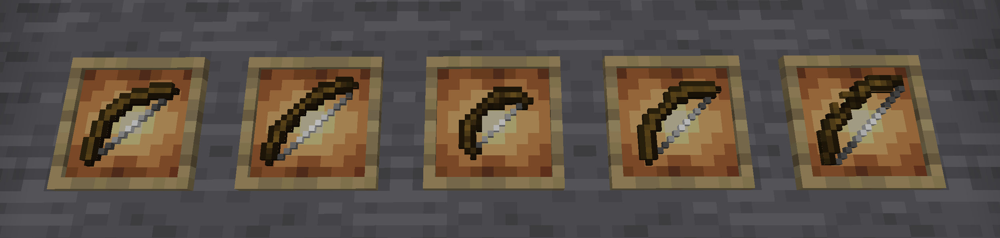
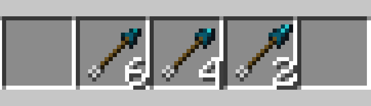

# Bows & arrows

## Bows

Forgero bows are craftable using all wood and metals available in the game. Bows have reinforcement, grip and dye
upgrade
slots which makes it possible to customise them to your liking. Reinforcement and grip upgrades will also improve the
attributes
of the bows.
Different materials and schematics will enhance different attributes which affects different aspects of shooting arrows.

### Available bow variants

* **Vanilla**
    * identical to the vanilla bow

* **Longbow**
    * Visual improvements
    * Lower draw speed
    * Higher draw power

* **Shortbow**
    * Higher draw speed
    * Lower draw power

* **Refined** - Improvements over vanilla
    * Visual improvements
    * Higher draw speed
    * Higher draw power

* **Mastercrafted** - Improvements over vanilla
    * Visual improvements
    * Higher draw speed
    * Higher draw power

## Arrows

### Available arrow variants

Arrows can be created from a handle/stick, feather and arrow heads. All materials can be used for the handle and arrow
head.

* **Vanilla**
    * identical to vanilla variants

* **Refined** - Improvements over vanilla
    * Visual improvements
    * Higher attack damage
    * Higher weight
    * Lower recipe output

* **Mastercrafted** - Improvements over refined
    * Visual improvements
    * Higher attack damage
    * Higher weight
    * Lower recipe output

## Stats

## Crafting & upgrades

Both arrows and bows can be crafted

### Bows

Bows are crafted by combining bow limbs with a string.

### Upgrades

Bows 
