# Bows & arrows

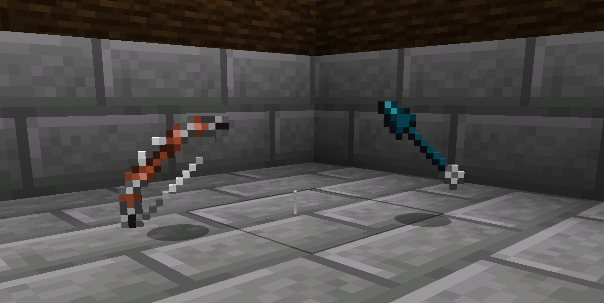

Forgero supports custom bows and arrow! Bows and arrows can be crafted using most materials and upgraded to enhance
looks and attributes.

## Bows

Forgero bows are craftable using all wood and metals available in the game. Bows have reinforcement, grip and dye
upgrade
slots which makes it possible to customise them to your liking. Reinforcement and grip upgrades will also improve the
attributes
of the bows.
Different materials and schematics will enhance different attributes which affects different aspects of shooting arrows.

### Available bow variants

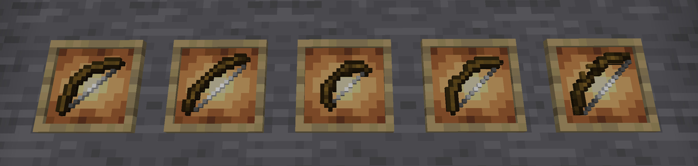

* **Vanilla**
    * identical to the vanilla bow

* **Longbow**
    * Visual improvements
    * Lower draw speed
    * Higher draw power

* **Shortbow**
    * Higher draw speed
    * Lower draw power

* **Refined** - Improvements over vanilla
    * Visual improvements
    * Higher draw speed
    * Higher draw power

* **Mastercrafted** - Improvements over vanilla
    * Visual improvements
    * Higher draw speed
    * Higher draw power

## Arrows

### Available arrow variants

Arrows can be created from a handle/stick, feather and arrow heads. All materials can be used for the handle and arrow
head.

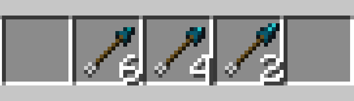

* **Vanilla**
    * identical to vanilla variants

* **Refined** - Improvements over vanilla
    * Visual improvements
    * Higher attack damage
    * Higher weight
    * Lower recipe output

* **Mastercrafted** - Improvements over refined
    * Visual improvements
    * Higher attack damage
    * Higher weight
    * Lower recipe output

## Stats

The bow and arrows in Forgero differ from vanilla minecraft in a couple of ways.

* Arrow weight makes it drop faster
* Arrow damage is calculated by arrow damage and it's velocity
* Stability can increase the accuracy of arrows
* Bows have custom draw speeds
* The draw power of the bow determines the velocity of the arrow, which makes the arrow fly further and faster
* The weight of the bow also decreases draw speed

What does this mean? Arrows made from heavier materials will drop faster than vanilla. Metal arrows might not be
feasible using the vanilla bow due to how fast the arrows will drop. Different material choices and upgrades can improve
bow performance.

## Crafting & upgrades

Both arrows and bows can be crafted from the ground up using schematics. The new schematics added by the bow module is
the bow limb schematics and the arrow head schematics. They also have simple recipes to make it easier to craft the
basic variants of arrows and bows.

### Bows

To get started with wooden bows, you can craft a simple variant using this recipe
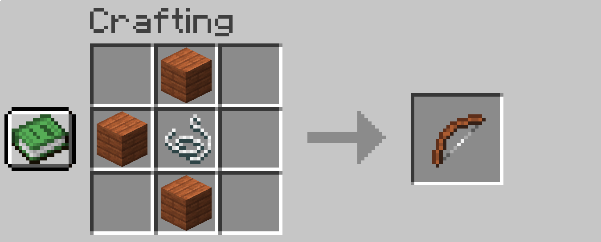

Bow limbs can be crafted from 3 materials and a schematic like this:
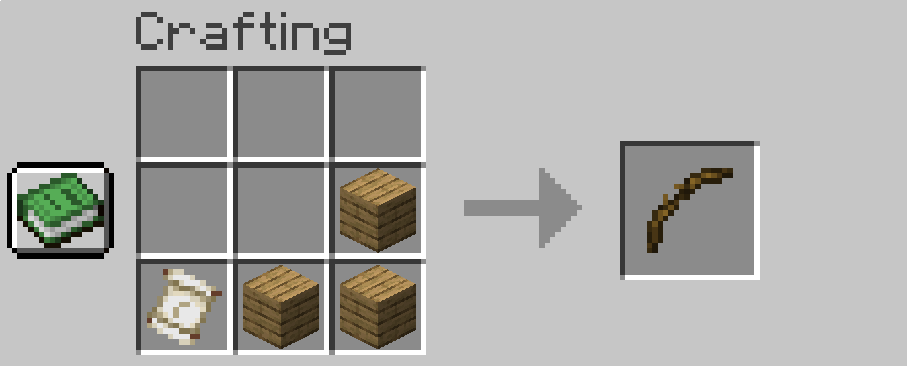

All bows can be crafted by combining string and bow limbs in the crafting table like this
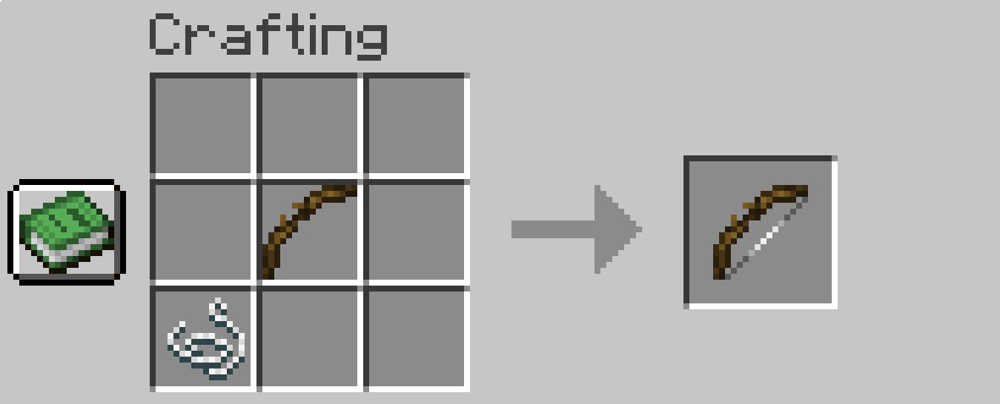

### Arrow

To get started with arrows, you can either use the vanilla arrow, or use this recipe to create normal arrows from a wide
range of materials.
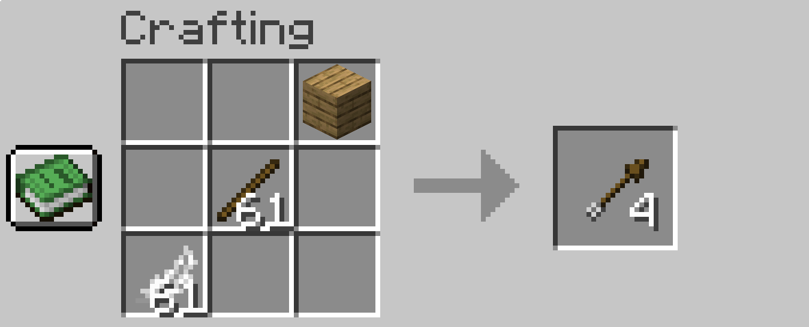

To create a custom arrow head, you need a schematic and any tool materials.
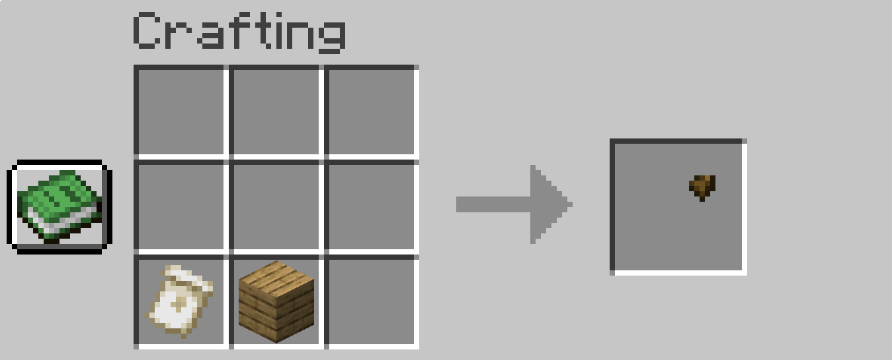

Mastercrafted, refined and vanilla arrows each have different yields when crafting from arrow heads. Any type of handle
can be used as the arrow shaft. Vanilla arrow recipes using arrow heads yields 6x arrows while refined yields 4x and
mastercrafted yields 2x.
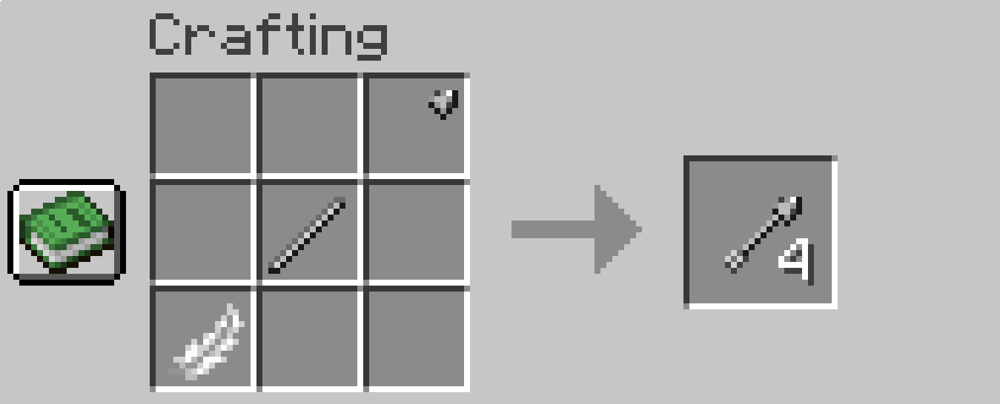

### Upgrades

Only the bows have crafting slots at the moment, but we're going to implement arrows with upgradeable heads in the
future.

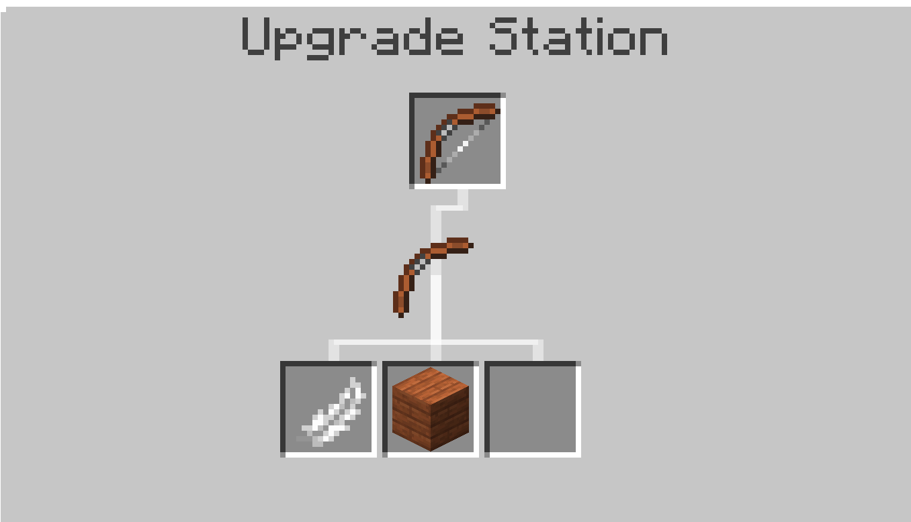
Vanilla, refined and mastercrafted bows all have the same upgrade slots, but the upgrades makes them look different.
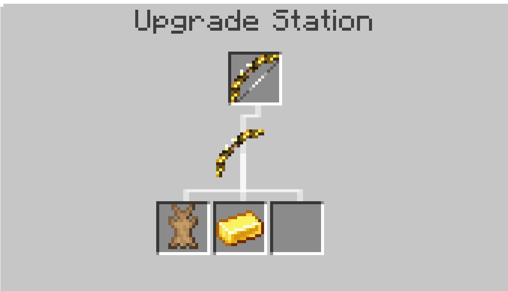
Upgrades with metals will increase the draw power, but decrease draw speed. Woods slightly increases draw power, but
does not decrease draw speed.
