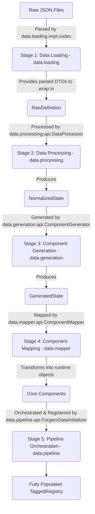

## Core Data Architecture: A Pipeline Overview

The `data` folder in Forgero Core is the backbone of the mod's content, responsible for loading, processing, generating, and mapping all item definitions from raw JSON files into functional runtime components. It is structured as a clear, sequential pipeline, with each module representing a distinct stage of transformation. This design aims to provide explicit contracts (APIs) for data at each stage, while encapsulating the underlying implementation complexities.

### Overall Data Flow

The data pipeline can be visualized as a five-stage process:

Each stage consumes the output of the previous stage, applies transformations, and produces a new, more refined data structure.

---

### Stage 1: Data Loading (`data.loading`)

This initial stage focuses on reading raw JSON files from resources and transforming them into structured, albeit unprocessed, data objects.

*   **Purpose:** To define the schema for raw JSON input data and provide the concrete logic for deserializing these files into Java objects. This module bridges the gap between external JSON definitions and the internal data pipeline.
*   **Data Input:** Raw JSON files located in mod resources.
*   **Data Output (API):** The module doesn't explicitly expose a "stage output" DTO beyond the raw DTOs themselves. Instead, its primary role is to provide the `data.processing` module with the necessary tools and `RawDefinition` *type* to accept its input.
    *   `data.loading.api.data.*`: These packages contain all the Data Transfer Objects (DTOs) that directly mirror the structure of your raw JSON files (e.g., `MaterialData`, `AttributeData`, `FeatureData`, `EquipmentTemplateData`). These DTOs define the *schema contract* for all raw input data. They represent "what" data is expected in the JSON.
    *   `data.loading.api.data.condition.PredicateCodecRegistry`: This public registry allows other modules or addons to register custom logic for parsing new types of conditions defined in JSON, making the condition system extensible.
    *   `data.loading.api.data.feature.FeatureCodecRegistry`: Similar to the predicate registry, this allows for dynamic registration of custom feature parsing logic.
*   **Implementation (`data.loading.impl.codec`):**
    *   `AttributeCodecs.java`, `ConditionCodecs.java`, `EquipmentTemplateCodecs.java`, etc.: These concrete classes contain the `com.mojang.serialization.Codec` instances. These codecs are the *how* of deserialization, translating JSON into the `data.loading.api.data.*` DTOs. They are implementation details hidden from direct pipeline consumers, used by the `ForgeroDataInitializer` internally.

---

### Stage 2: Data Processing (`data.processing`)

This stage takes the raw data objects and performs a critical normalization step, resolving dependencies and merging properties.

*   **Purpose:** To transform raw, potentially fragmented, definitions into a complete and self-contained "normalized" state. This includes resolving `include` directives (where one definition inherits properties from another) and merging attributes, features, and tags. It also detects and prevents cyclic dependencies.
*   **Data Input (API):**
    *   `data.processing.api.RawDefinition.java`: This record encapsulates a single raw DTO along with its canonical identifier. It's the explicit input contract for the `DataProcessor`.
*   **Data Output (API):**
    *   `data.processing.api.NormalizedState.java`: This comprehensive record holds all definitions after include resolution and property merging. It represents the *cleaned, consolidated data* and serves as the explicit output contract for this stage, providing the input for the next stage.
*   **Core Service (API):**
    *   `data.processing.api.DataProcessor.java`: The interface defining the contract for the normalization process.
*   **Implementation (`data.processing.impl`):**
    *   `DataProcessorImpl.java`: The concrete implementation of `DataProcessor`, containing the recursive logic for dependency resolution and property merging.
    *   `DefinitionBuilder.java`: An internal helper class used by `DataProcessorImpl` to efficiently accumulate and override properties during the merging process.

---

### Stage 3: Component Generation (`data.generation`)

This stage leverages the normalized data to create new, combinatorial item definitions.

*   **Purpose:** To generate all possible composite items (like tools or multi-part components) by combining materials, shapes, and other parts based on defined templates. This allows for a vast number of items to be defined with a relatively small set of templates and base components.
*   **Data Input:** Implicitly, the `NormalizedState` from the `data.processing` stage is consumed.
*   **Data Output (API):**
    *   `data.generation.api.GeneratedState.java`: This record contains all newly created combinatorial definitions, such as generated parts (e.g., `iron-pickaxe_head`) and generated equipment (e.g., `diamond-sword`). It explicitly defines the output contract for this stage.
*   **Core Service (API):**
    *   `data.generation.api.ComponentGenerator.java`: The interface defining the contract for component generation.
*   **Implementation (`data.generation.impl`):**
    *   `ComponentGeneratorImpl.java`: The concrete implementation of `ComponentGenerator`, responsible for iterating through templates and combinations to construct the `GeneratedState`.
    *   `IdResolver.java`: An internal utility used by `ComponentGeneratorImpl` to process templated ID strings (e.g., `{material.name}-{shape.name}`) and produce unique identifiers for generated items.

---

### Stage 4: Component Mapping (`data.mapper`)

This stage is the bridge from static data definitions to dynamic, runtime game objects.

*   **Purpose:** To transform the processed and generated DTOs into the actual `com.sigmundgranaas.forgero.core.component.api.Component` objects that represent items in the game. This involves converting DTO properties (attributes, features, conditions) into their corresponding runtime representations and building the component's internal structure and upgrade slots.
*   **Data Input:** Implicitly, the `NormalizedState` (for static parts, materials, shapes, schematics) from `data.processing` and `GeneratedState` (for generated parts and equipment) from `data.generation` are consumed.
*   **Data Output:** Runtime `com.sigmundgranaas.forgero.core.component.api.Component` objects.
*   **Core Service (API):**
    *   `data.mapper.api.ComponentMapper.java`: This concrete class serves as the public API for the mapping process. Its overloaded `map` methods define the explicit contract for how different DTO types are converted into runtime components.

---

### Stage 5: Pipeline Orchestration (`data.pipeline`)

This module serves as the central control for the entire data loading and initialization process.

*   **Purpose:** To orchestrate the sequential execution of all data stages, from raw file loading through processing, generation, and mapping. Finally, it takes all the generated runtime components and registers them into a central `TaggedRegistry`, making them accessible to the rest of the application. This module hides the complexity of the multi-stage pipeline from external consumers.
*   **Orchestration Service (API):**
    *   `data.pipeline.api.ForgeroDataInitializer.java`: This class is the public facade for the entire data pipeline. External systems (like the main mod entry point) interact solely with this initializer to kick off the data loading and retrieve the fully populated `TaggedRegistry` and `TagGraph`.

---

This refined architecture for the `data` folder provides a clear, stage-by-stage progression of data transformation. Each module contributes a well-defined piece to the puzzle, improving modularity, testability, and the overall understanding of the data flow.
